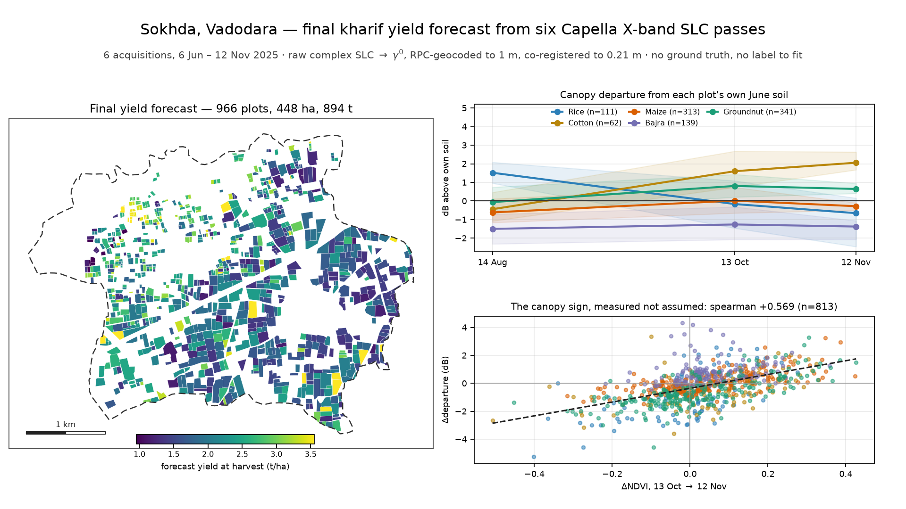
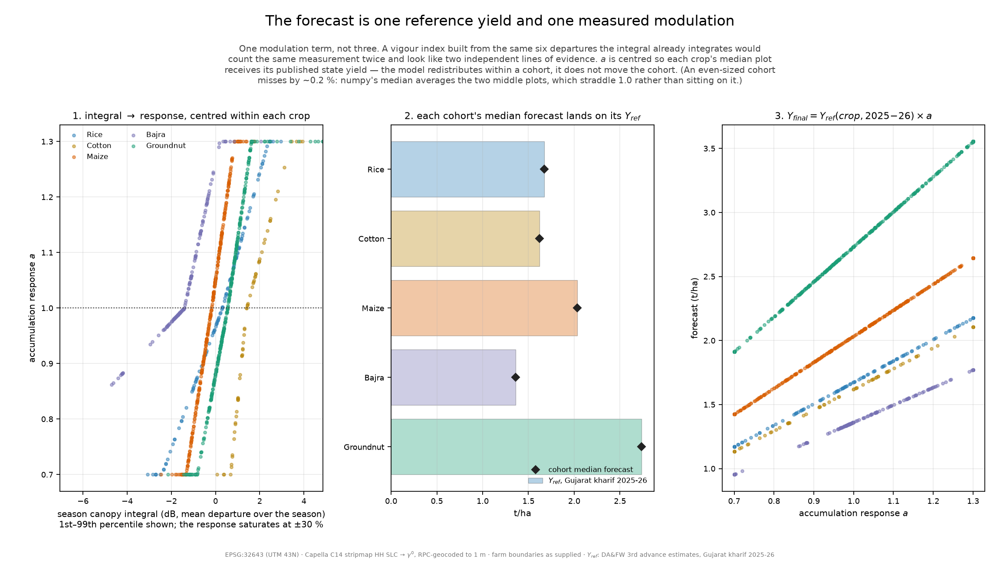
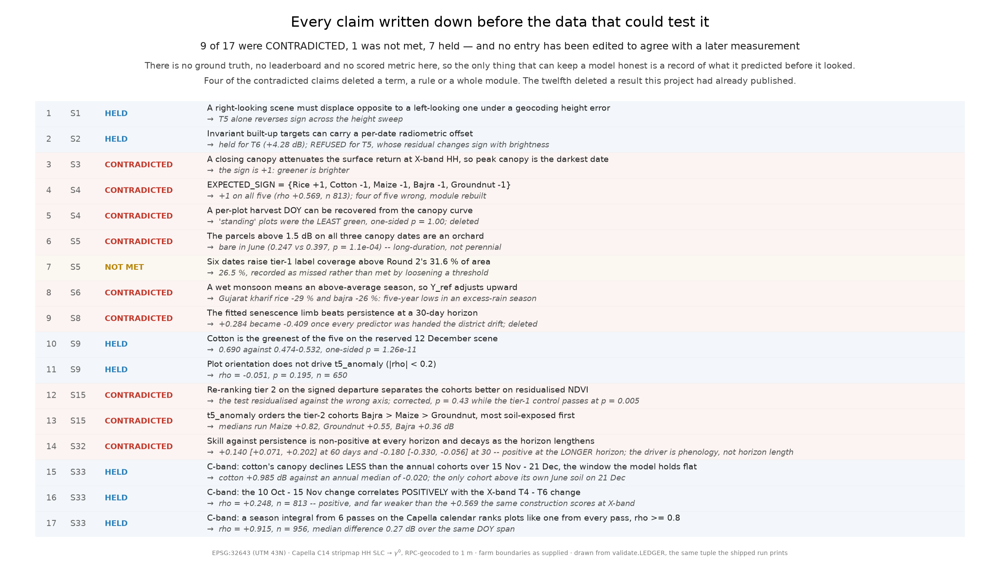
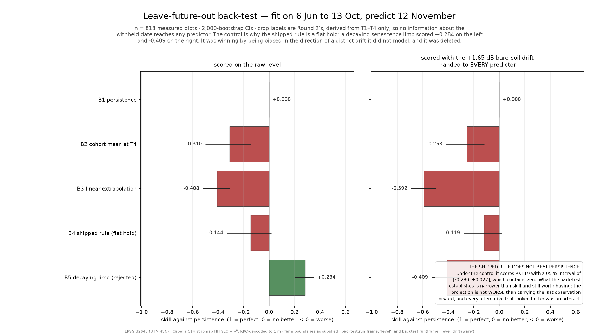
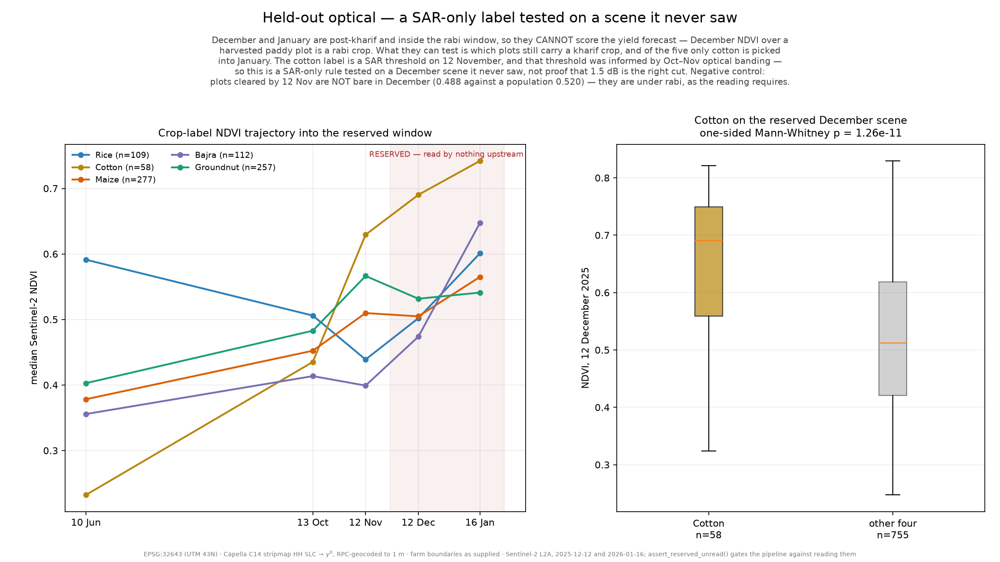
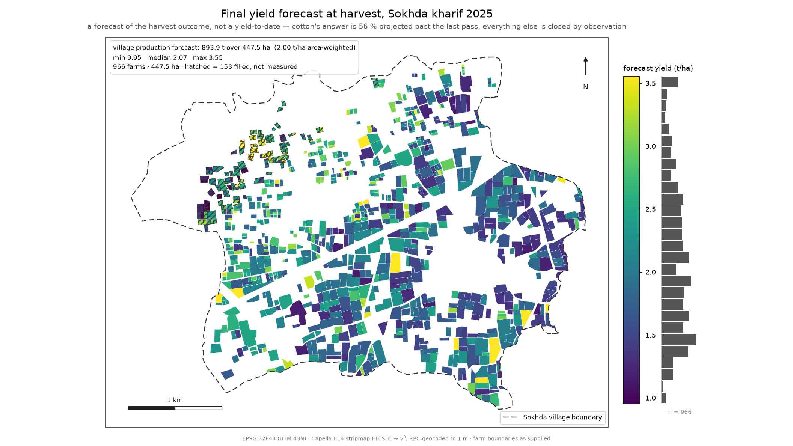
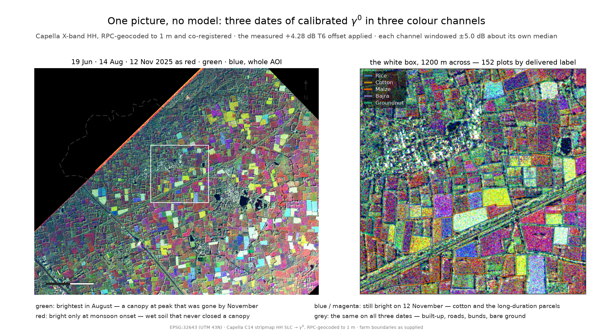
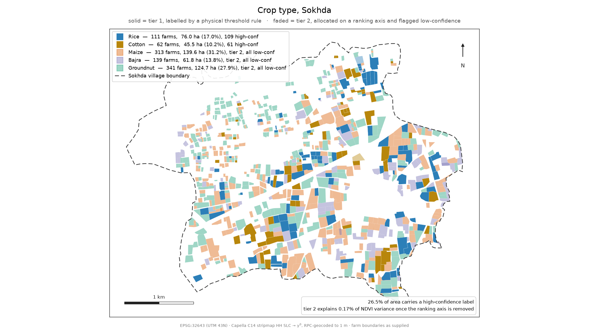
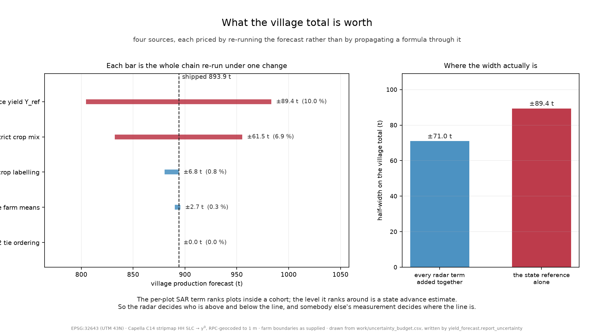

# SAR Crop Yield Forecasting

<p align="center">
  
</p>

**Final kharif yield forecasting from six Capella X-band SAR acquisitions under a no-ground-truth setting**

[](https://www.python.org/)
[](#)
[](https://www.kaggle.com/competitions/anrf-aise-hack-2-0-round-3-sar-crop-yield-forecasting)
[-brightgreen.svg)](#reproducibility--setup)

---

## Executive Summary & Technical Positioning

This repository contains the Round 3 final submission codebase for **ANRF AISEHack 2.0 (Round 3 — Goa Finale)** hosted by GalaxEye Space Solutions. The task requires plot-level final yield forecasting for Kharif 2025 across Sokhda village (Vadodara district, Gujarat, India), using six Capella X-band HH Synthetic Aperture Radar (SAR) acquisitions spanning 6 June to 12 November 2025.

### Key Study Parameters & Shipped Forecast

| Parameter / Metric | Value |
| :--- | :--- |
| **Study Area** | Sokhda village, Vadodara, Gujarat, India |
| **Parcel Count** | 966 farm plots (447.5 ha total agricultural area) |
| **Primary Data Source** | 6 Capella X-band HH Single Look Complex (SLC) scenes |
| **Acquisition Window** | 6 June 2025 – 12 November 2025 |
| **Crop Classes (5)** | Rice, Cotton, Maize, Bajra, Groundnut |
| **Headline Yield Forecast** | **893.9 t** over 447.5 ha (**2.00 t/ha** area-weighted) |
| **Ground Truth Yield** | **None** (No plot-level yield labels; no competition leaderboard) |
| **Validation Framework** | Pre-registered ledger, leave-future-out back-test, reserved optical, Sentinel-1 witness |

---

## What This Project Does

In the absence of plot-level ground truth yield labels, standard supervised regression is impossible. Instead, this system uses a physically and phenologically constrained estimation pipeline that scales official seasonal crop reference yields by an observed season-complete SAR canopy integral:

```text
Y_final(plot) = Y_ref(crop, 2025-26) * a(season canopy integral)
```

- **Y_ref(crop, 2025-26)**: The state/district official seasonal reference yield derived from published 3rd Advance Estimates.
- **season canopy integral**: The signed, time-integrated SAR gamma-nought (gamma0) departure relative to the June soil baseline across the six Capella acquisitions.
- **a(.)**: A bounded cohort-centred scaling function (a(.) in [0.70, 1.30]) that redistributes production among plots of the same crop according to relative canopy accumulation.

---

## Technical Challenges & Non-Trivialities

Working with six X-band SLC acquisitions under real-world conditions presents severe physical and geometrical complexities:

1. **Reversed Geometry on Pass T5 (10 September 2025)**: T5 was acquired with right-looking geometry, whereas T1–T4 and T6 were left-looking. At 1 m spatial resolution, phase correlation failed (108 m shift) because shadow and layover reversed sides. A two-scale search was implemented to achieve co-registration down to 0.06–1.48 m.
2. **Radiometric Offsets & Precipitation**: Pass T5 occurred at 01:37 IST following 63.1 mm of rainfall over 3 days. T6 exhibited a global +4.28 dB sensor offset across invariant targets. T6 was corrected radiometrically, while T5 baseline level was withheld from the canopy integral and replaced by T4–T6 interpolation due to soil moisture wetting anomalies.
3. **Canopy Sign Arbitration**: Physical intuition suggested X-band backscatter attenuates with canopy volume (negative departure). However, same-day Sentinel-2 optical comparisons (13 Oct and 12 Nov) proved that greening correlates positively with SAR backscatter (+1 sign across all 5 crops, rho = +0.569, p = 8.1e-71). The pipeline was modified to enforce +1 signed departures.
4. **Cotton Season Extrapolation**: Cotton growth cycle extends into January 2026, outrunning the last Capella observation (12 November 2025). The model applies a flat canopy continuation rule past 12 November, carrying 56% of cotton canopy-days.

---

## End-to-End Pipeline Architecture

The execution flow (enforced by `src/pipeline.py`) follows 14 strict processing stages:

```text
Capella SLC Ingest ──► Geocoding & Calibration ──► Blocking Quality Gates ──► Scene Diagnostics
                                                                                   │
Crop Yield Forecast ◄── Phenology & Sign ◄── Sentinel-2 Arbitration ◄── Farm Feature Extraction
        │
        ├──► Leave-Future-Out Back-Test
        ├──► Reserved Optical Check (Dec 25 / Jan 26)
        ├──► Sentinel-1 C-band Audit (16 passes, validation-only)
        └──► Output Aggregation (Farm, Village, Zone summaries & Figures)
```

<p align="center">
  
  <br>
  <em>Figure 1: Full pipeline execution chain from Capella SLC processing to validation and output generation.</em>
</p>

> **Note on Independent Witness**: Sentinel-1 C-band data is strictly a validation-only witness (`src/s1_audit.py`). It does NOT supply features, labels, or inputs to the forecast model.

---

## Pre-Registration & Falsification Ledger

To ensure scientific integrity, **17 hypotheses were pre-registered** in code before unblinding test data. When empirical evidence contradicted a hypothesis, the contradiction was recorded in the ledger rather than quietly erased.

- **Pre-registered Ledger Summary**: **7 Held**, **9 Contradicted**, **1 Not Met** (Tier-1 area coverage threshold).

<p align="center">
  
  <br>
  <em>Figure 2: Pre-registration ledger displaying pre-committed claims and empirical outcomes.</em>
</p>

Key falsification examples:
- **Hypothesis P4 (Canopy Sign)**: Expected negative SAR backscatter response for 4/5 crops. *Contradicted*: Optical arbitration showed positive backscatter correlation across all crops (+1). Pipeline updated accordingly.
- **Hypothesis P5 (Decaying Extrapolation)**: Proposed exponential decay projection for cotton after 12 November. *Contradicted*: Decaying projection failed against persistence in drift-aware back-testing. Pipeline updated to flat hold.

---

## Validation Strategy & Key Results

Validation is the core deliverable of this project. The methodology incorporates multiple independent verification layers:

### 1. Headline Leave-Future-Out Back-Test
Models were trained on passes T1–T4 to forecast withheld pass T6 (12 November 2025) using Round 2 crop labels:
- **30-Day Withheld Horizon (Flat-Hold Rule)**: rho = -0.119 [-0.280, +0.022]
- **60-Day Withheld Horizon**: rho = +0.140 [+0.071, +0.202]

> **Honest Assessment**: The shipped projection rule does **not** beat persistence at the headline 30-day horizon (-0.119). It fails where harvest events occurred mid-window, but recovers skill at 60 days (+0.140).

<p align="center">
  
  <br>
  <em>Figure 3: Back-test validation showing performance against persistence across withheld temporal horizons.</em>
</p>

### 2. Reserved Optical Validation (Sentinel-2)
Two post-Kharif Sentinel-2 scenes (12 December 2025 and 16 January 2026) were reserved strictly for validation (`validate.assert_reserved_unread()` enforces zero upstream access):
- Cotton December NDVI was **0.690** compared to **0.474–0.532** for harvested crops (one-sided p = 1.26e-11).
- Proves SAR-only classification correctly identified standing long-duration cotton on unblinded future optical imagery.

<p align="center">
  
  <br>
  <em>Figure 4: Reserved optical NDVI distributions validating late-season standing cotton.</em>
</p>

### 3. Independent Sentinel-1 C-Band Audit
16 Sentinel-1 IW RTC passes (12 June – 21 December 2025) were analyzed independently:
- Cotton backscatter remained **+0.985 dB** above its June bare-soil baseline through 21 December, confirming that holding cotton canopy flat past 12 November is physically realistic.
- Six-pass Capella temporal integral correlated at rho = +0.915 against a dense 13-pass C-band integral, validating acquisition sampling density.

### 4. Spatial Coherence & Confound Controls
- **Moran Spatial Autocorrelation**: Within-crop residual yield exhibits significant spatial structure (I = +0.151, p < 0.001, 999-permutation test).
- **Look-Direction Control**: Parcel row azimuth vs. T5 anomaly showed no look-direction bias (rho = -0.051, p = 0.195).

---

## Kharif 2025 Crop-Wise Forecast Results

Village-level production totals sum exactly to the farm-level output file (`outputs/farm_forecast.csv`), rounded once prior to aggregation:

| Crop Class | Farm Plots | Area (ha) | Area Share | Yield (t/ha) | Production (t) | 10th–90th %ile (t/ha) |
| :--- | ---: | ---: | ---: | ---: | ---: | :--- |
| **Groundnut** | 341 | 124.7 | 27.9% | 2.66 | 331.7 | 2.19 – 3.47 |
| **Maize** | 313 | 139.6 | 31.2% | 1.96 | 273.7 | 1.50 – 2.50 |
| **Rice** | 111 | 76.0 | 17.0% | 1.69 | 128.2 | 1.24 – 2.11 |
| **Bajra** | 139 | 61.8 | 13.8% | 1.40 | 86.6 | 1.20 – 1.64 |
| **Cotton** | 62 | 45.5 | 10.2% | 1.62 | 73.8 | 1.19 – 1.93 |
| **Total / Area-Wt** | **966** | **447.5** | **100.0%** | **2.00** | **893.9** | **1.36 – 3.04** |

<p align="center">
  
  <br>
  <em>Figure 5: Plot-level final yield forecast map (t/ha) across Sokhda village.</em>
</p>

---

## Visual Gallery

<p align="center">
  
  <br>
  <em>Figure 6: Multi-temporal Capella X-band SAR false-color composite over Sokhda AOI.</em>
</p>

<p align="center">
  
  <br>
  <em>Figure 7: Reconstructed 5-class crop map across 966 farm parcels.</em>
</p>

<p align="center">
  
  <br>
  <em>Figure 8: Forecast variance decomposition (External inputs: ±150.9 t vs. Radar modulation: ±9.5 t).</em>
</p>

---

## Data Sources & Dependencies

### 1. Competition Dataset (Restricted)
- **Capella X-Band SLC Scenes (6 dates)**: 3.2 GB total.
- **Vector Polygons**: `Farm_boundaries_shp/` (966 plots) and `Village_Shp/`.
- **Licensing & Access**: Competition Use Only. **Not redistributed** in this repository. Download directly from [Kaggle ANRF AISEHack 2.0 Round 3](https://www.kaggle.com/competitions/anrf-aise-hack-2-0-round-3-sar-crop-yield-forecasting/data).

### 2. Shipped Derived Tables & Cache
- `kaggle_dataset/round2_crops.csv`: 966 farm plot crop allocations from Phase 2.
- `kaggle_dataset/s1_per_farm.csv`: Pre-computed Sentinel-1 backscatter time series for offline audit.
- `work/s2_cache/`: Cached Sentinel-2 STAC responses for offline execution.

### 3. Contextual External Data
- **Sentinel-2 L2A**: Optical STAC via MPC / Earth Search (validation and canopy sign arbitration).
- **Sentinel-1 IW RTC**: C-band 10 m backscatter (validation-only witness).
- **DA&FW 3rd Advance Estimates**: Official 2025–26 Gujarat crop reference yields.

---

## Reproducibility & Setup

### Requirements & System Setup
- **Python**: 3.11+
- **System Dependency (GDAL)**: Required prior to installing Python packages.
  - Linux (Debian/Ubuntu): `sudo apt-get update && sudo apt-get install -y gdal-bin libgdal-dev python3-gdal`
  - macOS: `brew install gdal`

### Environment Installation
Create a virtual environment and install dependencies:

```bash
python3 -m venv .venv
source .venv/bin/activate
pip install -r requirements.txt
pip install "gdal==$(gdal-config --version)"
```

### Data Path Configuration
Set the path to the unpacked competition data directory:

```bash
export SAR_DATA_DIR=/path/to/unpacked/competition_data
```

### Execution Commands

```bash
# Run full pipeline (~15 min; requires network for optical cache on first run)
python src/pipeline.py

# Run offline mode (skips optical network calls; retains yield forecast)
python src/pipeline.py --no-s2

# Run test suite
python -m pytest tests/ -q

# Check notebook synchronization
python build_notebook.py --check

# Trace writeup statistics against execution logs
python audit_writeup.py --trace writeup.md
```

> **Data Limitation Note**: Executing `src/pipeline.py` or running the full test suite requires downloading the 3.2 GB Capella dataset from Kaggle and setting `SAR_DATA_DIR`.

---

## Repository Structure

```text
.
├── src/                  # Core pipeline processing modules (16 files)
│   ├── pipeline.py       # Main orchestration script
│   ├── geocode.py        # Capella SLC calibration & RPC geocoding
│   ├── coreg_calib.py    # Two-scale co-registration & radiometric normalisation
│   ├── farm_features.py  # Zonal statistics extraction over 966 plots
│   ├── phenology.py     # Signed canopy integration & growth tracking
│   ├── crop_type.py      # Tier 1/2 crop classification logic
│   ├── yield_forecast.py # Reference yield scaling & uncertainty bounds
│   ├── validate.py       # Back-testing & pre-registered hypothesis ledger
│   └── s1_audit.py       # Independent Sentinel-1 C-band audit
├── tests/                # Regression & unit tests (test_pipeline.py)
├── docs/                 # Detailed methodology & scientific documentation
│   ├── model_architecture.md
│   ├── validation_strategy.md
│   ├── leakage_analysis.md
│   ├── research_log.md
│   └── judge_report.md
├── figures/              # Shipped visual evidence gallery (15 PNGs)
├── outputs/              # Shipped forecast CSVs (farm, village, zone summaries)
├── kaggle_dataset/       # Shipped non-sensitive derived CSV tables
├── logs/                 # Clean execution logs (pipeline_clean.log)
├── writeup.md            # Final 2,000-word submission write-up
├── sokhda_yield_forecast.ipynb # Notebook auto-generated from src/
└── requirements.txt      # Python dependency manifest
```

---

## Documentation Deep Dive

For detailed technical derivations and logs, refer to the relative links below:

- [Methodology & Model Architecture](docs/model_architecture.md)
- [Validation Strategy & Statistical Tests](docs/validation_strategy.md)
- [Leakage Analysis & Audit Findings](docs/leakage_analysis.md)
- [Research & Experimentation Log](docs/research_log.md)
- [Adversarial Self-Audit & Judge Report](docs/judge_report.md)
- [Competition Framework Notes](docs/competition.md)
- [Submission Package Notes](docs/submission.md)

---

## Key Limitations

1. **No True Yield Ground Truth**: Model level is anchored to official state reference statistics (Y_ref); radar data modulates plot distribution rather than setting absolute scale.
2. **Back-Test Performance**: The 30-day withheld back-test (rho = -0.119) does not outperform persistence, reflecting challenges in predicting harvest timing from sparse temporal samples.
3. **Limited SAR Temporal Stack**: 6 Capella observations leave multi-week gap windows (e.g., 60-day gap between September and November).
4. **Sub-optimal Tier-2 Labels**: Tier-2 crop assignments rely on district crop mix allocation rather than direct SAR physical boundary separation.
5. **Plot Coverage**: 153 of 966 plots were incomplete across all six acquisitions (82 temporally interpolated, 71 spatially imputed).

---

## License Notice

No formal open-source license file is currently included in this repository. The competition SAR dataset remains subject to GalaxEye Space Solutions / Kaggle ANRF AISEHack 2.0 Competition Use terms.
